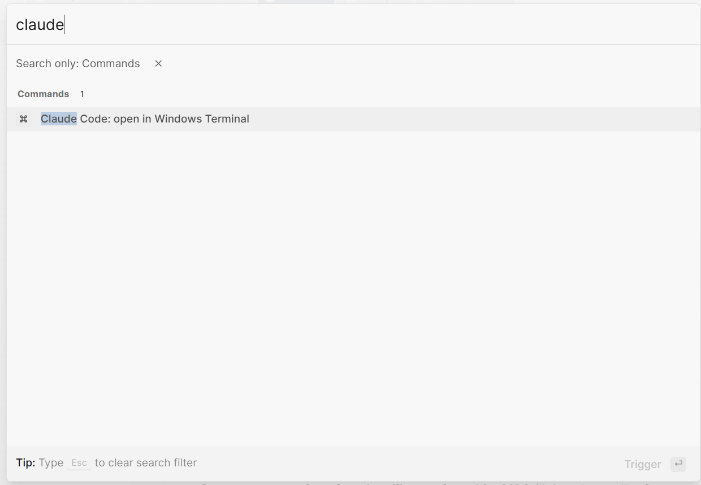

# Logseq Claude Code (WSL)

Open [Claude Code](https://claude.com/claude-code) on your Logseq graph directory directly from Logseq — one click in the toolbar launches Claude inside a new Windows Terminal session running WSL.

For Logseq Desktop on Windows with WSL.

## Screenshots




## Features

- Toolbar icon (Claude logo) that launches Claude on the current graph
- `Ctrl+Shift+P` palette command `Claude Code: open in Windows Terminal`
- `/Claude Code` slash command in any block
- Settings panel for graph path, claude command, WSL distribution
- One-time, reversible Windows URL-protocol registration (HKCU only, no admin)
- No native modules: pure HTML/JS plugin, sandboxed and marketplace-friendly

## Requirements

- Logseq Desktop for Windows
- [Windows Terminal](https://aka.ms/terminal) (`wt.exe` on PATH)
- WSL with a working `claude` command available inside an interactive login shell

## Installation

### From the Logseq marketplace

1. In Logseq: `...` -> **Plugins** -> **Marketplace** -> search **Claude Code (WSL)** -> **Install**.
2. Open the plugin **Settings** and set **Graph directory (Windows path)**.
3. **First-time setup**: open File Explorer at `%USERPROFILE%\.logseq\plugins\logseq-claude-code-wsl\` and double-click `setup.reg`. Confirm the Windows prompt to register the `claudewsl://` URL handler.
4. Click the Claude icon in the toolbar.

### From source (development)

```
git clone https://github.com/teddyhoss/logseq-claude-code-wsl
cd logseq-claude-code-wsl
npm install
npm run build
```

In Logseq: `...` -> **Plugins** -> **Load unpacked plugin** -> select the cloned folder. Then follow steps 2-4 above.

## First-time setup

The plugin needs a small Windows URL-protocol registration so it can ask the OS shell to launch a terminal — Logseq plugins cannot spawn processes directly. This is the same mechanism Zoom, Slack and VS Code use for their `zoommtg://`, `slack://` and `vscode://` URLs.

**Open File Explorer** and navigate to:

```
%USERPROFILE%\.logseq\plugins\logseq-claude-code-wsl\
```

Double-click **`setup.reg`** -> confirm the Windows prompt. This writes one key under `HKEY_CURRENT_USER\Software\Classes\claudewsl` — no admin elevation, reversible.

To **uninstall** the registration later, double-click **`uninstall.reg`** in the same folder.

## Configuration

All settings live under `Plugins -> Claude Code (WSL) -> Settings`:

| Setting | Default | Description |
| --- | --- | --- |
| Graph directory (Windows path) | *empty* | Absolute Windows path. Example: `C:\Users\you\Logseq`. Avoid pure virtual drive letters (Google Drive `G:\` in streaming mode); use the local Drive mirror under `C:\Users\you\My Drive\...` instead so WSL can translate it. |
| Claude command | `claude` | Command executed inside WSL via `bash -lic`. |
| WSL distribution | *empty* | Specific distro name (passed as `-d`). |
| URL protocol name | `claudewsl` | Custom URL scheme registered in the Windows registry. Must match `setup.reg`. |

## How it works

```
toolbar click
  -> claudewsl:// URL navigation (anchor click inside plugin iframe)
  -> HKCU URL handler -> cmd.exe -> launcher.cmd -> launcher.ps1
  -> launcher.ps1 reads plugin settings JSON, spawns:
     wt.exe new-tab wsl.exe --cd "<graphPath>" -- bash -lic "<claudeCommand>"
  -> bash sources .profile + .bashrc, claude takes over the Windows Terminal TTY
```

The plugin itself is fully sandboxed (no `child_process`, no `node-pty`, no `effect: true`). Process spawning is delegated to the OS via the registered URL protocol, exactly as web apps launch Zoom and VS Code.

## Troubleshooting

- **Toolbar button does nothing** — the URL protocol is not registered yet. Double-click `setup.reg` in the plugin folder.
- **`Wsl/ERROR_FILE_NOT_FOUND` / `ERROR_PATH_NOT_FOUND`** — the configured `graphPath` cannot be translated to a WSL path. Most often caused by Google Drive `G:\` streaming mode. Switch to the local Drive mirror under `C:\Users\you\...`, or move the graph out of a virtualized filesystem.
- **`claude: command not found`** — `claude` is not on the PATH of `bash -lic`. Verify with `which claude` in an interactive WSL session; if it shows a path, ensure your `.bashrc`/`.profile` exports it.
- **Custom WSL distro** — set **WSL distribution** in plugin settings. List your distros with `wsl -l -v`.

## Uninstallation

1. Double-click `uninstall.reg` in the plugin folder (removes the HKCU registry entry).
2. In Logseq: `...` -> **Plugins** -> uninstall **Claude Code (WSL)**.

## License

MIT
